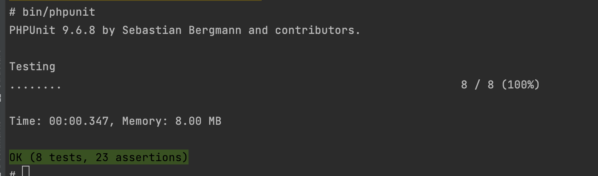

# Rating API

Clients rate their experience

## Installation

If you need to install php and composer, use any of the official [PHP](https://www.php.net/downloads.php) and
[Composer](https://getcomposer.org/download/) installers provided for your operating system.

Clone the project repository:

```bash
git clone git@github.com:salihbasakk/rating-api.git
```
Create .env file from .env.dist (with related database configuration)

Example:

```bash
DATABASE_NAME=rating-api
DATABASE_ROOT_PASSWORD=123456!
DATABASE_PORT=3306
```

```bash
docker-compose up -d --build
```

```bash
docker exec -it php-app /bin/sh
```

```bash
php bin/console doctrine:migrations:migrate
```

## Testing

```bash
bin/phpunit
```




